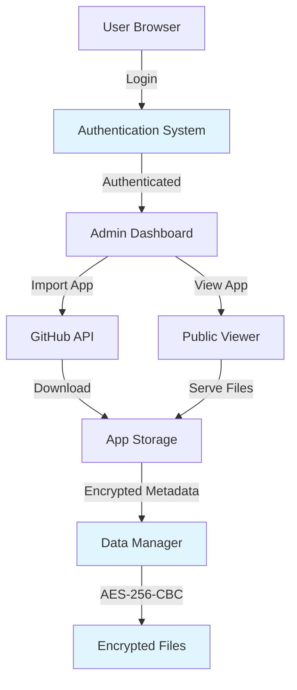
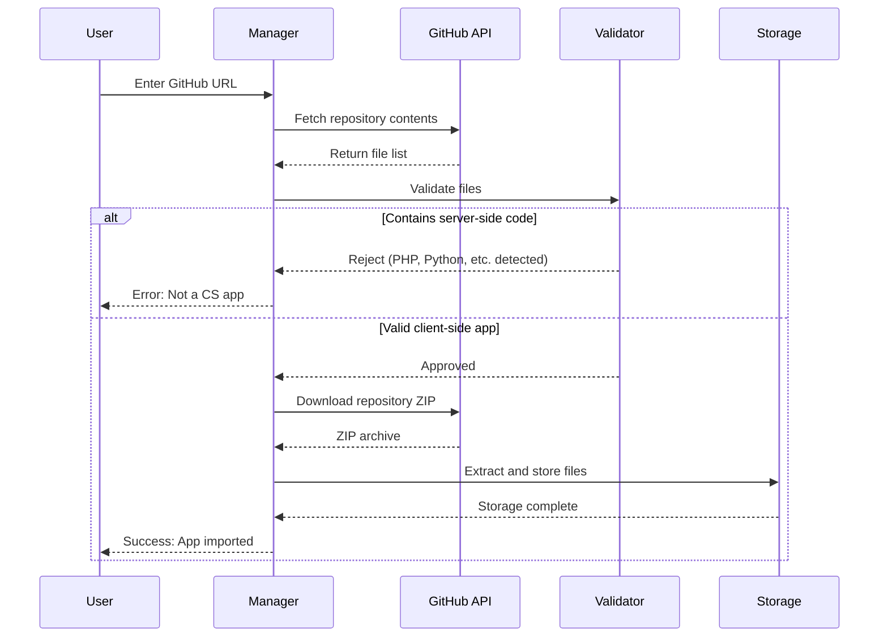
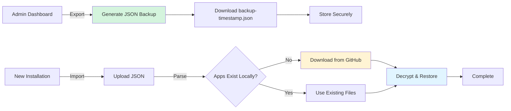

# xsukax GitHub CS App Manager

A secure, self-hosted platform for importing, organizing, and hosting client-side applications directly from GitHub repositories. This lightweight PHP application provides an encrypted, password-protected environment for managing multiple static web applications with an intuitive categorization system.

## 🎯 Project Overview

The xsukax GitHub CS App Manager is designed for developers and teams who need a centralized platform to manage and deploy client-side applications from GitHub. By focusing exclusively on client-side (CS) applications—those built with HTML, CSS, and JavaScript without server-side dependencies—this manager ensures secure, straightforward hosting while preventing the inadvertent deployment of server-side code.

### Primary Capabilities

- **Automated GitHub Import**: Clone and deploy client-side applications directly from public or private GitHub repositories
- **Intelligent App Detection**: Automatically validates that repositories contain only client-side code, rejecting projects with server-side components
- **Category-Based Organization**: Structure your app collection with customizable categories for easy navigation
- **Update Monitoring**: Check GitHub repositories for updates without manual intervention
- **Backup & Restore**: Export your entire app collection and configuration, then restore on any compatible server
- **Secure Multi-User Access**: Share deployed applications publicly while keeping management functions password-protected

## 🔒 Security and Privacy Benefits

Security and privacy are foundational to the xsukax GitHub CS App Manager. The application implements multiple layers of protection to ensure your data remains confidential and your platform remains secure.

### Data Encryption

- **AES-256-CBC Encryption**: All sensitive data including app metadata and category information is encrypted at rest using industry-standard AES-256-CBC encryption
- **PBKDF2 Key Derivation**: Passwords are processed through PBKDF2 (100,000 iterations) with SHA-256 to generate encryption keys, protecting against brute-force attacks
- **Unique Salt Generation**: Each installation generates a unique cryptographic salt, ensuring identical passwords produce different encrypted data across installations
- **Bcrypt Password Hashing**: Administrative passwords are hashed using bcrypt before storage, providing additional protection beyond encryption

### Access Control

- **Session-Based Authentication**: Secure session management with HttpOnly cookies prevents JavaScript-based session hijacking
- **Protected File System**: Comprehensive file access controls prevent unauthorized access to sensitive files including encryption keys, password hashes, and configuration data
- **Path Traversal Protection**: Input sanitization blocks directory traversal attacks (e.g., `../` sequences) that could expose system files

### Application Security

- **Server-Side Code Detection**: The import process automatically scans repositories for server-side files (PHP, Python, Node.js, Composer, etc.) and rejects any repository containing such files, preventing security vulnerabilities
- **Controlled File Serving**: Only whitelisted file types can be served to users, blocking executable files and potential malware
- **MIME Type Enforcement**: Proper Content-Type headers are enforced for all served files, preventing MIME-type confusion attacks
- **Secure File Storage**: All imported applications are stored outside the web root when possible, with controlled access through the application

### Privacy Considerations

- **No External Dependencies**: After initial GitHub import, apps run entirely from your server without making requests to external services
- **No Tracking or Analytics**: The platform includes no telemetry, tracking, or analytics code
- **Data Sovereignty**: All application data remains on your server under your control
- **Private Repository Support**: Import apps from private GitHub repositories using personal access tokens without exposing credentials

## ✨ Features and Advantages

### Core Features

- **One-Click GitHub Import**: Enter a GitHub repository URL and the app is automatically cloned, validated, and deployed
- **Smart Category Management**: Create unlimited categories, rename them, and reorganize apps with drag-and-drop-style functionality
- **Update Notifications**: Check if imported apps have new commits on GitHub without re-importing
- **GitHub Token Support**: Access private repositories by providing a personal access token during import
- **Backup System**: Export all apps and categories to a single JSON file for disaster recovery or migration
- **Intelligent Restore**: Import backups with automatic re-download of missing app files from GitHub
- **Responsive Interface**: Modern, mobile-friendly UI built with Tailwind CSS
- **Real-Time Feedback**: Toast notifications keep you informed of all operations without page reloads

### Unique Advantages

- **Client-Side Focus**: Unlike general hosting platforms, this manager is specifically designed for static web applications, ensuring optimal security
- **Zero Configuration**: Works immediately after upload with sensible defaults
- **Lightweight**: Single PHP file architecture with no database requirements
- **Framework Agnostic**: Supports any client-side framework (React, Vue, Angular, Svelte, vanilla JavaScript, etc.)
- **Self-Contained Apps**: Each imported app is isolated with its own directory structure
- **No Build Step**: Deploy pre-built applications directly from GitHub release branches

## 📋 Requirements

- PHP 7.4 or higher
- PHP Extensions:
  - `openssl` - For encryption operations
  - `zip` - For extracting GitHub archives
  - `json` - For data serialization
  - `mbstring` - For string handling
- Web server (Apache, Nginx, or similar)
- Writable directory permissions for data storage

## 🚀 Installation Instructions

### Step 1: Download and Upload

1. Download `index.php` from this repository
2. Upload `index.php` to your web server (e.g., `public_html/apps/`)
3. Ensure the directory is writable by the web server (755 or 775 permissions)

### Step 2: PHP Configuration

Ensure your `php.ini` has the following settings configured appropriately:

```ini
; Required extensions
extension=openssl
extension=zip
extension=json
extension=mbstring

; Recommended settings for handling larger apps
upload_max_filesize = 50M
post_max_size = 50M
max_execution_time = 300
memory_limit = 256M

; Security settings
allow_url_fopen = On  ; Required for GitHub API access
```

### Step 3: Access the Application

1. Navigate to your installation URL (e.g., `https://yourdomain.com/apps/`)
2. Log in with the default credentials:
   - **Password**: `admin@123`
3. **Important**: Immediately change the default password after first login

### Step 4: Optional - Secure with .htaccess

For Apache servers, create a `.htaccess` file in the same directory:

```apache
# Protect sensitive files
<FilesMatch "\.(enc|dat|pass)$">
    Order Allow,Deny
    Deny from all
</FilesMatch>

# Prevent directory listing
Options -Indexes
```

## 📖 Usage Guide

### Application Architecture



### Importing Your First App

1. **Locate a Client-Side App on GitHub**
   - Find a repository containing a client-side web application
   - Ensure it has an `index.html` file in the root directory
   - Example: `https://github.com/username/my-web-app`

2. **Import the Application**
   - In the admin dashboard, find the "Import CS App" section
   - Enter the GitHub repository URL
   - Select a category (default: "General")
   - Optionally provide a GitHub token for private repositories
   - Click "Import App"

3. **Access Your App**
   - Once imported, the app appears in your dashboard
   - Click "Open" to launch the app in a new tab
   - Share the generated URL with others for public access

### App Import and Validation Flow



### Managing Categories

**Create a Category**:
1. Click the `+` button next to "Categories" in the sidebar
2. Enter a category name
3. Click "Save"

**Rename a Category**:
1. Click the ✏️ icon next to any category (except "General")
2. Enter the new name
3. Click "Save"

**Delete a Category**:
1. Click the 🗑️ icon next to the category
2. Confirm deletion
3. All apps in that category will move to "General"

**Move Apps Between Categories**:
1. Locate the app you want to move
2. Use the dropdown menu at the bottom of the app card
3. Select the target category

### Checking for Updates

1. Click the 🔄 button on any app card
2. The system queries GitHub for the latest commit
3. If updates are available, you'll see the commit hashes
4. **Note**: Updates must be manually re-imported; automatic updates are not performed to preserve customizations

### Backup and Restore Workflow



**Creating a Backup**:
1. Click "Backup" in the header
2. Click "Export"
3. Save the JSON file securely (contains encrypted data)

**Restoring a Backup**:
1. On a new installation, click "Backup"
2. Click "Choose File" and select your backup JSON
3. Optionally provide a GitHub token if apps came from private repositories
4. Click "Import & Download"
5. The system will restore categories and download any missing app files from GitHub

### Changing Your Password

1. Click "Password" in the header
2. Enter your current password
3. Enter your new password
4. Click "Update"
5. **Important**: All encrypted data is automatically re-encrypted with the new password

### Public App Access

Apps can be accessed without authentication using the generated URL format:
```
https://yourdomain.com/apps/?action=view&app=APP_ID
```

Users can navigate the app freely, but cannot access management functions without logging in.

## 🔧 Advanced Configuration

### Custom Data Directory

By default, data is stored in `apps_data/` within the installation directory. To change this, edit the following line in `index.php`:

```php
define('DATA_DIR', __DIR__ . '/apps_data');
```

### GitHub API Rate Limits

- **Unauthenticated requests**: 60 requests per hour per IP
- **Authenticated requests**: 5,000 requests per hour
- **Recommendation**: Use a personal access token for better rate limits

### Supported File Types

The application serves the following file types:
- HTML, CSS, JavaScript, JSON
- Images: PNG, JPG, JPEG, GIF, SVG
- Fonts: WOFF, WOFF2, TTF

Additional types can be added by modifying the `$types` array in the file serving section.

## 🐛 Troubleshooting

**Issue**: "API request failed" during import
- **Solution**: Check your server's firewall allows outbound HTTPS connections to `api.github.com`

**Issue**: "Download failed" error
- **Solution**: Verify the repository has a `main` or `master` branch; ensure repository is public or token has correct permissions

**Issue**: Apps don't load after import
- **Solution**: Verify the repository has an `index.html` in the root directory; check browser console for errors

**Issue**: "Not a CS app" error during import
- **Solution**: The repository contains server-side code (PHP, Python, package.json, etc.); only pure client-side apps are supported

**Issue**: Password change fails
- **Solution**: Ensure you're entering the current password correctly; check file permissions on `apps_data/` directory

## 📄 License

This project is licensed under the GNU General Public License v3.0.

## 🤝 Contributing

Contributions are welcome! Please feel free to submit pull requests, report issues, or suggest new features through the GitHub repository.

## 📞 Support

For questions, issues, or feature requests, please open an issue on the [GitHub repository](https://github.com/xsukax/xsukax-GitHub-CS-App-Manager).

---

**Made with ❤️ by xsukax** | Secure Client-Side App Hosting Platform
